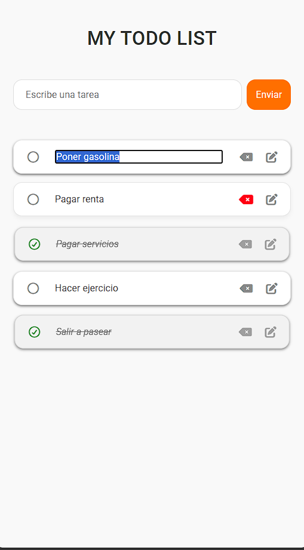
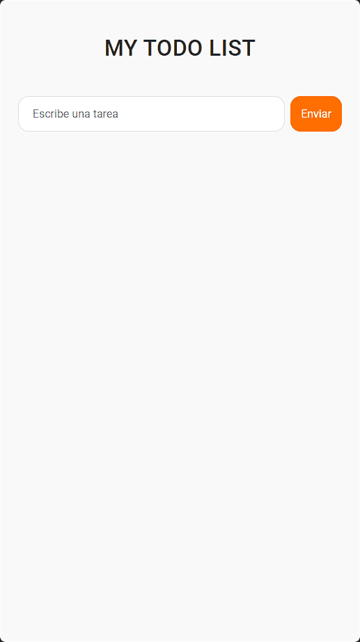

# 📝 To-Do List (HTML, CSS, JS)

## 📌 Descripción
Proyecto sencillo de lista de tareas desarrollado en **HTML, CSS y JavaScript puro**.  
Creado para practicar después de mi curso básico de JS y acostumbrarme a trabajar con **objetos, clases, JSON y LocalStorage**.

## 🚀 Demo
Prueba la aplicación aquí: [To-Do List en GitHub Pages](https://dagoberto17.github.io/to-do-list/)

## 🎯 Funcionalidades
- Agregar nuevas tareas
- Editar tareas existentes
- Marcar tareas como completadas
- Eliminar tareas
- Persistencia en LocalStorage

## 📸 Capturas
| Vista principal | Demo en acción |
|-----------------|----------------|
|  |  |

## 📄 Licencia
Este proyecto está bajo la licencia MIT.
